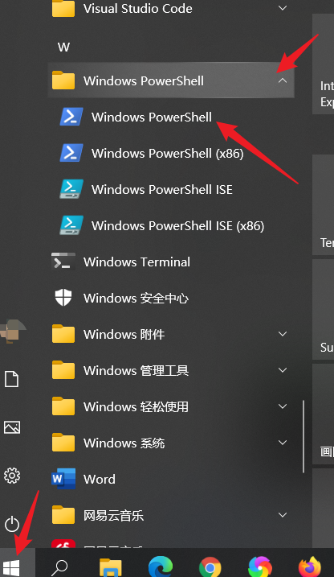
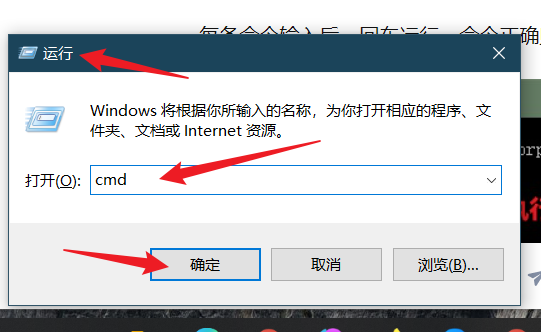
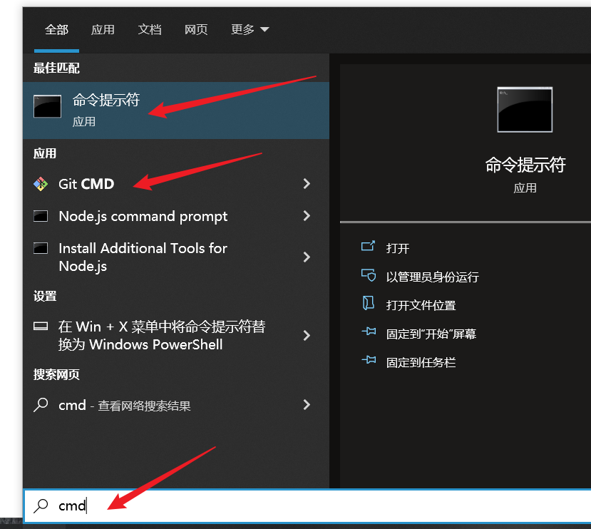
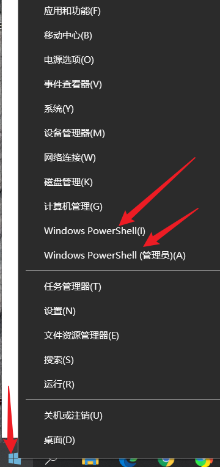
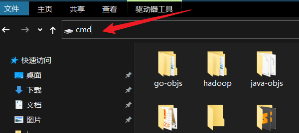
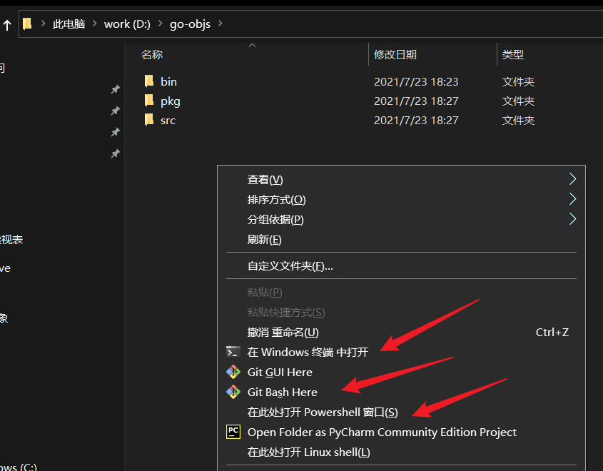

# Windows 终端使用与常用命令

Windows 系统基本所有的常规操作都可以通过图形界面完成， 而不需要使用 Terminal 终端窗口和命令。但有时使用终端和命令又是必要的，在某些应用场景下比图形界面更高效。例如你需要用命令来自动完成任务或执行批量操作。

## 如何打开终端窗口

许多人不知道终端窗口在哪里打开，其实打开终端窗口方法非常多：

- 开始菜单找

- 运行 cmd

按快捷键 `Win + R` 打开运行，输入 `cmd`，点确定；

- 搜索 cmd

按快捷键 `Win + S` 打开搜索，输入 `cmd`：

- 开始菜单右键单击

- 文件夹地址栏输入 `cmd`，回车

这种方法打开的终端，直接进入这个盘符或文件夹。

- 文件夹中使用 Shift 键

在某个文件夹（或盘）中，按住 Shift 键，鼠标右键单击。这种方法打开的终端，也是直接进入这个盘符或文件夹：

另外很多开发软件，都有终端窗口，例如 git，vscode 等。

打开终端窗口，我们才能进行各种命令操作。Windows 的所有命令可以在官网找到：https://docs.microsoft.com/zh-cn/windows-server/administration/windows-commands/windows-commands。

## 终端窗口使用技巧

- 终端窗口中可以选中内容 `Ctrl + C` 进行复制，然后直接单击右键粘贴。

- 使用过的命令，可以用上下方向键轮换，再次使用。

- tab 键可以自动补全。

- 命令使用的符号是英文状态下的符号。

- 命令参数中文件路径有空格，要用双引号包围：例如 `cd "c:\my file"`。

- 文件及目录名中不能包含字符：`\` `/` `:` `*` `?` `"` `<` `>` `|`。

- `Ctrl + C` 中断命令执行。

- 有时候需要管理员身份打开终端窗口，在找到或搜索到终端程序的时候，右键单击即可选择 `以管理员身份运行`。

- 有很多命令，需要 `命令提示符` 终端窗口中才能执行（或者不通过终端窗口，直接在程序中去执行，例如 Python 自动创建文件或删除文件）。

--- 

下面列出一些常用的命令：

**注意：**同样的操作，`Windows PoweShell` 和 `命令提示符` 终端窗口中执行的命令可能不一样。

## cd 切换目录

**示例：**

-  进入父目录

    cd ..  

-  进入上次 d 盘所在的目录（或在直接输入 `d:`）

    cd d:  

-  进入 d 盘根目录

    cd /d d:\  

-  显示上次 d 盘所在的目录

    cd d:

-  进入 d:\src 目录

    cd /d d:\src

-  进入当前目录下的 prj\src\view 文件夹

    cd prj\src\view 

## dir  显示目录中的内容

**示例：**

-  显示当前目录中的子文件夹与文件

    dir  

-  只显示当前目录中的子文件夹与文件的文件名

    dir /b 

-  分页显示当前目录中的子文件夹与文件

    dir /p 

-  显示当前目录中的子文件夹

    dir /ad 

-  显示当前目录中的文件

    dir /a-d 

-  显示 c:\test 目录中的内容

    dir c:\test  

-  显示当前目录中 keys.txt 的信息

    dir keys.txt 

-  递归显示当前目录中的内容

    dir /S  

-  显示当前目录下以 key 开头的文件和文件夹的信息

    dir key* 

-  只显示当前目录中隐藏的文件和目录，并按照文件大小从小到大排序

    dir /AH /OS 

## tree 显示目录结构

**示例：**

-  显示 d:\myfiles 目录结构

    tree d:\myfiles 

## ren  文件或目录重命名

**示例：**

-  将当前目录下的 rec.txt 文件重命名为 rec.ini

    ren rec.txt rec.ini 

-  将 c 盘下的 test 文件夹重命名为 test_01

    ren c:\test test_01 

-  将当前目录下的 Logs.txt 文件重命名为 Logs-20150114_2135.txt 或 Logs-20150114_ 812.txt（注意：小时只有个位数时会多一个空格，可以使用字符串替换：将空格替换成 0）

    ren Logs.txt Logs-%date:~0,4%%date:~5,2%%date:~8,2%_%time:~0,2%%time:~3,2%.txt 

## md  创建目录

**示例：**

-  在当前目录中创建名为 movie 和 music 的文件夹

    md movie music 

-  创建 d:\test\movie 目录

    md d:\test\movie 

## rd  删除目录

**示例：**

-  删除当前目录下的 movie 空文件夹

    rd movie

-  使用安静模式删除 d:\test（除目录本身外，还将删除指定目录下的所有子目录和文件）

    rd /s /q d:\test 

## copy 拷贝文件

**示例：**

-  将当前目录下的 key.txt 拷贝到 c:\doc 下（若 doc 中也存在一个 key.txt 文件，会询问是否覆盖）

    copy key.txt c:\doc 

-  将当前目录下 jobs 文件夹中文件（不递归子目录）拷贝到 c:\doc 下（若 doc 中也存在相应的文件，会询问是否覆盖）

    copy jobs c:\doc 

-  将当前目录下的 key.txt 拷贝到 c:\doc 下，并重命名为 key_bak.txt（若 doc 中也存在一个 key_bak.txt 文件，会询问是否覆盖）

    copy key.txt c:\doc\key_bak.txt 

-  将当前目录下的 key.txt 拷贝到 c:\doc 下（不询问，直接覆盖写）

    copy /Y key.txt c:\doc 

-  复制文件到自己，实际上是修改了文件日期

    copy key.txt + 

-  将当前目录下的 key1.txt 与 key2.txt 的内容合并写入 key.txt 中（不询问，直接覆盖写）

    copy /Y key1.txt + key2.txt key.txt 

-  将当前目录下的 art_2.7z.开头的所有文件（按照名称升序排序）依次合并生成 art_2.7z

    copy /B art_2.7z.* art_2.7z   

-  将当前目录下的 art_2.7z.001、art_2.7z.002 文件合并生成 art_2.7z

    copy /B art_2.7z.001+art_2.7z.002 art_2.7z   

## xcopy  更强大的复制命令

**示例：**

-  将 c:\bat\hai 中的所有内容拷贝到 d:\hello 中。注意：需要在 hello 后加上 \  表示 hello 为一个目录，否则 xcopy 会询问 hello 是 F，还是 D

    xcopy c:\bat\hai d:\hello\ /y /h /e /f /c   

-  将 c:\bat\hai 中的 2010 年 12 月 29 日后更改的文件拷贝到 d:\hello 中

    xcopy c:\bat\hai d:\hello\ /d:12-29-2010 

## robocopy  更强大的复制命令

**示例：**

-  将当前目录下 Plugins 中所有内容（排除名为 Intermediate 和 Binaries 的文件夹）保留目录结构拷贝到当前目录下的 PluginsDest 中（PluginsDest 不存在会自动创建）

    robocopy .\Plugins .\PluginsDest /MIR /xd Intermediate Binaries 

-  将 c:\test 中所有内容（排除名为 UE4Editor-SGame-Win64-DebugGame.dll 和 pdb 后缀的文件）保留目录结构拷贝到 d:\test2 中（d:\test2 不存在会自动创建）

    robocopy c:\test d:\test2 /MIR /xd Intermediate /xf UE4Editor-SGame-Win64-DebugGame.dll *.pdb

## move 移动文件

**示例：**

-  将当前目录下的 png 图片移动到当前目录下 test 文件夹中 （若 test 中也存在同名的 png 图片，会询问是否覆盖）

    move *.png test 

-  将当前目录下的 png 图片移动到当前目录下 test 文件夹中 （不询问，直接覆盖写）

    move /Y *.png test 

-  将当前目录下的 1.png 移动到 d 盘 test 文件夹中，并重命名为 2.png （若 test 中也存在同名的 png 图片，会询问是否覆盖）

    move 1.png d:\test\2.png 

-  若 d 盘中存在 new 文件夹，将当前目录下的 test 文件夹移动到 d 盘 new 文件夹中；若不存在，将当前目录下的 test 文件夹移动到 d 盘，并重命名为 new

    move test d:\new 

## del 删除文件   

注意：目录及子目录都不会删除

/ar、/ah、/as、/aa 分别表示删除只读、隐藏、系统、存档文件

/a-r、/a-h、/a-s、/a-a 分别表示删除除只读、隐藏、系统、存档以外的文件

**示例：**

-  删除当前目录下的 test 文件夹中的所有非只读文件（子目录下的文件不删除；删除前会进行确认；等价于 del test\*）

    del test 

-  删除当前目录下的 test 文件夹中的所有文件（含只读文件；子目录下的文件不删除；删除前会进行确认；等价于 del /f test\*）

    del /f test 

-  删除当前目录下的 test 文件夹中所有文件及 d:\test2 中所有 doc 文件（含只读文件；递归子目录下的文件；删除前不确认）

    del /f /s /q test d:\test2\*.doc 

-  删除当前目录下所有只读文件

    del /ar *.*

-  删除当前目录下除系统文件以外的所有文件

    del /a-s *.*

## replace 替换文件

即使这个文件在使用，仍然可以替换成功

**示例：**

-  使用 d 盘下的 love.mp3 强制替换 d 盘 mp3 目录中的 love.mp3 文件

    replace d:\love.mp3 d:\mp3  

## attrib  查看或修改文件或目录的属性 

A：存档  R：只读  S：系统  H：隐藏

**示例：**

-  查看当前目录下 1.txt 的属性

    attrib 1.txt  

-  去掉 1.txt 的只读属性

    attrib -R 1.txt 

-  隐藏 movie 文件夹

    attrib +H movie 

## assoc 设置'文件扩展名'关联到的'文件类型'

**示例：**

-  显示所有'文件扩展名'关联

    assoc

-  显示.txt 代表的'文件类型'，结果显示.txt=txtfile

    assoc .txt

-  显示.doc 代表的'文件类型'，结果显示.doc=Word.Document.8

    assoc .doc

-  显示.exe 代表的'文件类型'，结果显示.exe=exefile

    assoc .exe

-  恢复.txt 的正确关联

    assoc .txt=txtfile 

## ftype 设置'文件类型'关联到的'执行程序和参数'

**示例：**

-  显示所有'文件类型'关联

    ftype

-  显示 exefile 类型关联的命令行，结果显示 exefile="%1" %*

    ftype exefile

-  设置 txtfile 类型关联的命令行为：C:\Windows\notepad.exe %1

    ftype txtfile=C:\Windows\notepad.exe %1

当双击一个.txt 文件时，windows 并不是根据.txt 直接判断用 notepad.exe 打开
而是先判断.txt 属于 txtfile'文件类型'；再调用 txtfile 关联的命令行：txtfile=%SystemRoot%\system32\NOTEPAD.EXE %1

## forfiles 递归目录执行命令

**示例：**

-  在当前目录下查找含有.svn 的文件或目录（递归子目录），并对该目录执行指定版本号 svn 更新

    forfiles /p . /m .svn /s /c "cmd /c svn up -r12005"

-  在 c:\myfiles 目录下查找含有.svn 的文件或目录（递归子目录），并对该目录执行指定版本号 svn 更新

    forfiles /p c:\myfiles /m .svn /s /c "cmd /c svn up -r12005"

## type 显示文本文件内容

**示例：**

-  显示 c 盘中 11.txt 的文本内容

    type c:\11.txt  

-  显示当前目录下 conf.ini 的文本内容

    type conf.ini 

-  分页显示 c 盘中 11.txt 的文本内容

    type c:\11.txt | more 

## more 逐屏的显示文本文件内容

**示例：**

-   逐屏的显示当前目录下 conf.ini 的文本内容，`空格`：下一屏, `q`：退出

    more conf.ini 

## 命令中常用的符号

`&`  顺序执行多条命令，而不管命令是否执行成功

-  先将当前工作目录切换到 d:\src 下，然后执行 work.exe /o c:\result.txt 命令

    cd /d d:\src&work.exe /o c:\result.txt 

`&&`  顺序执行多条命令，当碰到执行出错的命令后将不执行后面的命令

-  如果找到了"ok"字样，就显示"成功"，找不到就不显示

    find "ok" c:\test.txt && echo 成功

`||`   顺序执行多条命令，当碰到执行正确的命令后将不执行后面的命令

-  如果找不到"ok"字样，就显示"不成功"，找到了就不显示

    find "ok" c:\test.txt || echo 不成功  

`|`    管道命令

-  先执行 dir 命令，然后对输出结果（stdout）执行 find 命令（输出当前文件夹及所有子文件夹里的 .exe 文件的个数）

    dir *.* /s/a | find /c ".exe"  

-  先执行 dir 命令，然后对输出结果（stdout）和错误信息（stderr）执行 find 命令（输出当前文件夹及所有子文件夹里的.exe 文件的个数）

    dir *.* /s/a 2>&1 | find /c ".exe"  

`>`  将当前命令输出以覆盖的方式重定向

-  将 tasklist 的输出结果（stdout）以覆盖的方式重定向到 p1.txt 文件中（注：tasklist 的输出结果就不会打印到屏幕上了）

    tasklist > p1.txt  

-  等同于：tasklist > p1.txt

    tasklist 1> p1.txt 

-  输出结果（stdout）打印在屏幕上，错误信息（stderr）以覆盖的方式重定向到 p1.txt 中（注：bin 目录不存在时，会输出错误信息）

    dir bin 2> p1.txt 

-  将错误信息（stderr）重定向到输出结果（stdout），然后将输出结果（stdout）以覆盖的方式重定向到 p1.txt 中（注：bin 目录不存在时，会输出错误信息）

    dir bin > p1.txt 2>&1 

-  将输出结果（stdout）重定向到错误信息（stderr），然后将错误信息（stderr）以覆盖的方式重定向到 p1.txt 中（注：bin 目录不存在时，会输出错误信息） 注：与上条命令结果一致

    dir bin 2> p1.txt 1>&2 

-  屏幕上不打印 tasklist 的输出结果（stdout），错误信息（stderr）仍会打印

    tasklist >nul  

-  屏幕上不打印命令的错误信息（stderr），输出结果（stdout）仍会打印（注：bin 目录不存在时，会输出错误信息）

    dir bin 2>nul  

-   将命令的错误信息（stderr）重定向到输出结果（stdout），然后不打印输出结果（stdout）【屏幕上错误信息（stderr）和输出结果（stdout）都不打印】（注：bin 目录不存在时，会输出错误信息）

    dir bin >nul 2>&1  

-   将命令的输出结果（stdout）重定向到错误信息（stderr），然后不打印错误信息（stderr）【屏幕上错误信息（stderr）和输出结果（stdout）都不打印】（注：bin 目录不存在时，会输出错误信息）

    dir bin 2>nul 1>&2  

`>>`  将当前命令输出以追加的方式重定向

-  将 tasklist 的输出结果（stdout）以追加的方式重定向到 p2.txt 文件中（注：tasklist 的输出结果就不会打印到屏幕上了）

    tasklist >> p2.txt  

-  等同于：tasklist >> p2.txt

    tasklist 1>> p2.txt 

-  输出结果（stdout）打印在屏幕上，错误信息（stderr）以追加的方式重定向到 p2.txt 中（注：bin 目录不存在时，会输出错误信息）

    dir bin 2>> p2.txt 

-  将错误信息（stderr）重定向到输出结果（stdout），然后将输出结果（stdout）以追加的方式重定向到 p2.txt 中（注：bin 目录不存在时，会输出错误信息）

    dir bin >> p2.txt 2>&1 

-  将输出结果（stdout）重定向到错误信息（stderr），然后将错误信息（stderr）以追加的方式重定向到 p2.txt 中（注：bin 目录不存在时，会输出错误信息） 注：与上条命令结果一致

    dir bin 2>> p2.txt 1>&2 

`<`   从文件中获得输入信息，而不是从屏幕上，一般用于 date time label 等需要等待输入的命令

-  temp.txt 中的内容为 2005-05-01

    date <temp.txt 

`@`   命令修饰符  在执行命令前，不打印出该命令的内容

-  执行该命令时，不打印出命令的内容：`cd /d d:/me`

    @cd /d d:\me  

`,`    在某些特殊的情况下可以用来代替空格使用

-  相当于：`dir c:\`

    dir,c:\  

`;`   当命令相同的时候,可以将不同的目标用;隔离开来但执行效果不变。如执行过程中发生错误则只返回错误报告但程序还是会继续执行

-  相当于顺序执行：`dir c:\`    `dir d:\`     `dir e:\`

    dir c:\;d:\;e:\  

## cls  清除屏幕

## ver  显示当前 windows 系统的版本号

## winver  弹框显示当前 windows 系统信息

## whoami  显示当前用户的名称

## hostname  显示当前机器名

## vol  显示当前分区的卷标

## label  显示当前分区的卷标，同时提示输入新卷标

    label c:system  设置 c 盘的卷标为 system

## time  显示或设置当前时间

**示例：**

-  显示当前时间

    time /t 

-  设置新的当前时间（格式：hh:mm:ss），直接回车则表示放弃设置

    time  

## date  显示或设置当前日期

**示例：**

-  显示当前日期

    date /t 

-  设置新的当前日期（格式：YYYY/MM/DD），直接回车则表示放弃设置

    date  

## print

`print 1.txt` 使用设置好的打印机来打印 1.txt 文本文件

## timeout

`timeout 5` 延迟 5s

## call

`call ff.bat`  调用执行 ff.bat 脚本（ff.bat 脚本执行完原脚本才会往下执行）

## start  运行某程序或命令

**示例：**

-  最大化的方式启动记事本

    start /max notepad.exe 

-  最小化的方式启动计算器

    start /min calc.exe  

-  最小化的方式启动 Proxifier 代理工具

    start /min "" d:\Proxifier.exe  

-  启动一个 cmd 实例窗口，并运行 tasklist

    start  tasklist 

-  调用资源管理器打开 f 盘

    start explorer f:\ 

-  启动 ie 并打开 www.qq.com 网址

    strat iexplore "www.qq.com" 

-  启动开始执行 ff.bat（启动 ff.bat 脚本后，原脚本继续执行，不会等 ff.bat 脚本执行完）

    start ff.bat 

## exit  退出当前 cmd 窗口实例

**示例：**

-  退出当前 cmd 窗口实例，并将过程退出代码设置为 0（0 表示成功，非 0 表示失败）

    exit 0 

-  退出当前 bat 脚本，并将 ERRORLEVEL 系统变量设置为 1

    exit /B 1 

## pause  暂停批处理程序，并显示出：请按任意键继续....

## systeminfo  查看当前计算机的综合信息

## wmic 查看硬件的信息，查看进程信息

**示例：**

-  查看计算机上各个盘的相关信息

    wmic logicaldisk  

-  获取 C 盘的剩余空间大小与总大小（单位：Byte）

    wmic LogicalDisk where "Caption='C:'" get FreeSpace,Size /value  

-  获取当前 os 的 Caption、安装日期以及系统架构信息

    wmic os get Caption,InstallDate,OSArchitecture /value 

-  查看名为"buyticket.exe"所有进程命令行，exe 全路径，PID 及线程数

    wmic process where Caption="buyticket.exe" get commandline,ExecutablePath,ProcessId,ThreadCount /value

-  查看名为"buyticket.exe"所有进程的 exe 全路径及当前打开的句柄数

    wmic process where Caption="buyticket.exe" get ExecutablePath,HandleCount /value  

-  查看名为"buyticket.exe"所有进程的 exe 全路径、当前虚拟地址空间占用及物理内存工作集

    wmic process where Caption="buyticket.exe" get ExecutablePath,VirtualSize,WorkingSetSize /value  

## logoff  注销当前用户

## shutdown  关闭、重启、注销、休眠计算机

**示例：**

-  关闭计算机

    shutdown /s 

-  一小时后，关闭本地计算机

    shutdown /s /t 3600 

-  终止系统关闭

    shutdown /a 

-  关闭并重启本地计算机

    shutdown /r 

-  关闭并重启 ip 为 192.168.1.166 的计算机

    shutdown /m 192.168.1.166 /r 

-  关闭并重启计算机，重启后重新启动所有注册的应用程序

    shutdown /g 

-  注销本地计算机

    shutdown /l 

-  休眠本地计算机（强制正在运行的应用程序关闭，不前台警告用户）

    shutdown /h /f

**远程关机权限的获取：**

1）修改远程 pc 的“本地安全策略”，为指定的用户开放权限

在 WindowsXP 默认的安全策略中，只有 Administrators 组的用户才有权从远端关闭计算机，如果要给 xxxx 用户远程关机的权限。

可利用 WindowsXP 的“组策略”或“管理工具”中的“本地安全策略”来实现。

1. 命令行运行 gpedit.msc 打开“组策略编辑器“；

2. 导航到“计算机配置/Windows 设置/安全设置/本地策略/用户权利指派”；

3. 修改“从远端系统强制关机”，添加 xxxx 用户即可。

2）获得远程 IPC 管理权限

如果配置第一步后还出现“拒绝访问。”，则需要在运行 shutdown 命令前先运行如下命令

    net use \\[ip 地址或计算机名]\ipc$ password /user:xxxx

其中 password 为帐号 xxxx 的登录密码。

## regsvr32  注册或反注册 com 组件

**示例：**

-  以无声的方式注册 clock.ocx 组件

    regsvr32 /s clock.ocx 

-  卸载 myCommon.dll 组件

    regsvr32 /u myCommon.dll 

## format  格式化磁盘

**示例：**

-  以 ntfs 类型格式化 J 盘 

类型有:FAT、FAT32、exFAT、NTFS 或 UDF

    format J: /FS:ntfs  

-   以 fat32 类型快速格式化 J 盘

    format J: /FS:fat32 /Q 

## chkdsk

`chkdsk /f D:`   检查磁盘 D 并显示状态报告；加参数 `/f` 表示同时会修复磁盘上的错误

## subst   磁盘映射

磁盘映射信息都保存在注册表以下键值中：HKEY_CURRENT_USER\Network

**示例：**

-  显示目前所有的映射

    subst 

-  将 \\com\software 共享映射为本地 z 盘

    subst z: \\com\software 

-  将 e:\src 映射为本地 y 盘

    subst y: e:\src 

-  删除 z 盘映射

    subst z: /d 

## cmdkey  凭据 Credential（保存的用户名和密码）

**示例：**

-  列出可用的凭据

    cmdkey /list 

-  列出指定目标的凭据

    cmdkey /list:10.12.190.82 

-  列出指定目标的凭据

    cmdkey /list:Domain:target=10.12.190.82 

-  若 target 为 10.12.190.82 的凭据不存在，则添加；否则就将 10.12.190.82 凭据的用户名修改为 LiLei，密码修改为 123456

    cmdkey /add:Domain:target=10.12.190.82 /user:LiLei /pass:123456 

-  删除指定目标的凭据

    cmdkey /delete:Domain:target=10.12.190.82 

## cscript  执行 vbs 脚本

**示例：**

-  执行 mac.vbs 脚本，显示本机 mac 地址

    cscript /Nologo mac.vbs 

## netsh advfirewall  设置防火墙

windows 防火墙规则顺序：阻止规则的优先级高于允许规则

**示例：**

-  将防火墙当前的所有配置导出到 d:\test\advfirewall.pol 文件

    netsh advfirewall export "d:\test\advfirewall.pol" 

-  将 d:\test\advfirewall.pol 文件中规则导入到防火墙中

    netsh advfirewall import "d:\test\advfirewall.pol" 

-  将防火墙还原为默认策略

    netsh advfirewall reset 

-  关闭所有类型网络的防火墙（域网络【Domain】、家庭或工作的专用网络【Private】、公用网络都关闭【Public】）

    netsh advfirewall set allprofiles state off 

-  开启所有类型网络的防火墙

    netsh advfirewall set allprofiles state on 

-  关闭当前类型网络的防火墙

    netsh advfirewall set currentprofile state off 

-  开启当前类型网络的防火墙

    netsh advfirewall set currentprofile state on

-  开启域网络的防火墙

    netsh advfirewall set domainprofile state on 

-  关闭域网络的防火墙

    netsh advfirewall set domainprofile state off 

-  开启家庭或工作的专用网络的防火墙

    netsh advfirewall set privateprofile state on 

-  关闭家庭或工作的专用网络的防火墙

    netsh advfirewall set privateprofile state off  

-  开启公用网络的防火墙

    netsh advfirewall set publicprofile state on 

-  关闭公用网络的防火墙

    netsh advfirewall set publicprofile state off  

-  显示所有规则

    netsh advfirewall firewall show rule name=all  

-  显示名为 foxmail 的所有规则

    netsh advfirewall firewall show rule name=foxmail  

-  开启 ping 回显

    netsh advfirewall firewall set rule name="文件和打印机共享(回显请求 - ICMPv4-In)" new enable=yes 

-  删除所有名为 NiZhanBrowser 的规则

    netsh advfirewall firewall delete rule name=NiZhanBrowser 

-  删除所有名为 NiZhanBrowser 的入站规则

    netsh advfirewall firewall delete rule name=NiZhanBrowser dir=in 

-  删除所有名为 NiZhanBrowser 且操作为阻止的规则

    netsh advfirewall firewall delete rule name=NiZhanBrowser action=block 

-  添加名为 TCP-In-8888 入站规则：允许 TCP 端口 8888

    netsh advfirewall firewall add rule name=TCP-In-8888 protocol=TCP localport=8888 dir=in action=allow 

-  添加名为 TCP-In-8888 入站规则：阻止 TCP 端口 8888

    netsh advfirewall firewall add rule name=TCP-In-8888 protocol=TCP localport=8888 dir=in action=block 

-  添加名为 TCP-In-8888 出站规则：允许 TCP 端口 8888

    netsh advfirewall firewall add rule name=TCP-In-8888 protocol=TCP localport=8888 dir=out action=allow 

-  添加名为 TCP-In-8888 出站规则：阻止 TCP 端口 8888

    netsh advfirewall firewall add rule name=TCP-In-8888 protocol=TCP localport=8888 dir=out action=block 

- 添加名为 test1 入站规则：允许 TCP 端口 8888、远程 IP 地址在 10.96.208.0/23,10.96.154.0/23 区间、远程 Port 在 1024-2048,2050-65535

    netsh advfirewall firewall add rule name=test1 protocol=TCP localport=8888 remoteip=10.96.208.0/23,10.96.154.0/23 remoteport=1024-2048,2050-65535 dir=in action=allow 

- 添加名为 test2 入站规则：允许 TCP 端口 8888、本地 IP 地址在 10.46.50.32、本地 Port 在 3702

    netsh advfirewall firewall add rule name=test2 protocol=TCP localport=8888 localip=10.46.50.32 localport=3702 dir=in action=allow 

- 添加名为 test3 入站规则：允许 TCP 端口 8888、程序路径为：D:\tools\test3.exe

    netsh advfirewall firewall add rule name=test2 protocol=TCP localport=8888 program="D:\tools\test3.exe" dir=in action=allow 

- 用来查看帮助信息

    netsh advfirewall firewall add rule ?

## schtasks  任务计划

**示例：**

-  以较为详细易于阅读的格式显示本机所有任务计划信息

    schtasks /query /fo LIST /v 

-  创建一个名为 Soda Build 的任务计划：该任务计划每 20 分钟执行一下 d:\check.vbs 脚本

    schtasks /create /sc minute /mo 20 /tn "Soda Build" /tr d:\check.vbs 

-  强制创建一个名为 Soda Build 的任务计划（不进行确认）：该任务计划每天凌晨 2 点 06 分执行一下 D:\updateall.bat 脚本

    schtasks /create /tn "Soda Build" /tr D:\updateall.bat /sc daily /st 02:06 /f 

-  强制删除 Soda Build 名称的任务计划（不进行确认）

    schtasks /delete /tn "Soda Build" /f 

-  将名为 Soda Build 的任务计划的执行脚本修改为 d:\check2.vbs

    schtasks /change /tn "Soda Build" /tr d:\check2.vbs 

-  执行名为 Soda Build 的任务计划

    schtasks /run /tn "Soda Build"

-  终止执行名为 Soda Build 的任务计划

    schtasks /end /tn "Soda Build"

## net

-  查看已经启动的服务

    net start  

-  开启任务计划服务

    net start "Task Scheduler"   

-  不询问，直接关闭任务计划服务

    net stop "Task Scheduler" /y  

-  开启 dns 缓存服务

    net start dnscache  

-  不询问，直接关闭 dns 缓存服务

    net stop dnscache /y  

-  开启 Remote Desktop Services 服务

    net start TermService  

-  不询问，直接关闭 Remote Desktop Services 服务

    net stop TermService /y  

-  查看当前用户下的共享目录

    net share   

-  取消名为 workFile 的共享状态

    net share workFile /delete  

-  将 c:\360Downloads 设为共享，并取名为 xxx

    net share xxx=c:\360Downloads   

-  开启 ipc$共享

    net share ipc$ 

-  删除 ipc$共享

    net share ipc$ /del 

-  删除 c 盘共享

    net share c$ /del 

-  建立 192.168.1.166 的 ipc 空链接

    net use \\192.168.1.166\ipc$ " " /user:" " 

-  直接登陆后建立 192.168.1.166 的 ipc 非空链接（用户名为 administrator 密码为 123456）

    net use \\192.168.1.166\ipc$ "123456" /user:"administrator"   

-  直接登陆后映射 192.168.1.166 的 c 盘到本地为 h 盘（用户名为 administrator 密码为 123456）

    net use h: \\192.168.1.166\c$ "123456" /user:"administrator"   

-  登陆后映射 192.168.1.166 的 c 盘到本地为 h 盘

    net use h: \\192.168.1.166\c$   

-  删除 ipc 链接

    net use \\192.168.1.166\ipc$ /del  

-  删除本地的 h 盘的映射

    net use h: /del 

-  查看本地局域网内开启了哪些共享

    net view   

-  查看 192.168.1.166 的机器上在局域网内开启了哪些共享

    net view \\192.168.1.166  

-  查看本地机器的日期及时间

    net time \\127.0.0.1   

-  查看本地机器的日期及时间

    net time \\localhost   

-  查看 192.168.1.166 机器的日期及时间

    net time \\192.168.1.166   

-  设置本地计算机时间与 192.168.1.166 主机的时间同步，加上参数/yes 可取消确认信息

    net time \\192.168.1.166 /set  

-  查看当前机器上的用户

    net user  

-  查看当前机器上的 Administrator 用户的信息

    net user Administrator   

-  启用 Guest 用户

    net user Guest /active:yes  

-  新建一个名为 dev，密码为 123456 的用户

    net user dev 123456 /add   

-  把名为 dev 的用户添加到管理员用户组中，使其具有管理员权限

    net localgroup administrators dev /add  

-  删除名为 dev 的用户

    net user dev /del  

## tasklist 显示当前运行的进程信息（可查看 PID）

## taskkill  结束指定的进程

**示例：**

-  结束名为 notepad.exe 的进程

    taskkill /im notepad.exe 

-  结束 pid 为 1230、1241 和 1253 的进程以及由它们启动起来的子进程

    taskkill /pid 1230 /pid 1241 /pid 1253 /t

-  强制结束有名为 cmd.exe 的进程以及由它启动起来的子进程

    taskkill /f /im cmd.exe /t  

## ping 

用于检测网络是否通畅，以及网络时延情况（工作在 ICMP 协议上）

**示例：**

-   测试与 baidu 服务器的连接情况

    ping baidu.com  

-  测试机器名为 chen-pc0 的连接情况

    ping chen-pc0  

-  测试与 ip 为 220.181.111.86 的连接情况

    ping 220.181.111.86  

-  向 qq.com 发送 10 次 65500 字节的 ping

    ping -l 65500 -n 10 qq.com  

-  对当前主机执行 6 次 ping 操作（花费时间为 5s）

    ping -n 6 127.0.0.1

-  不断地测试 baidu 服务器的连接情况 `Ctrl+Pause Break`：查看 ping 的统计信息；`Ctrl+C`：终止当前任务

    ping -t baidu.com  

## ipconfig

-  查看本地 ip 地址等详细信息

    ipconfig /all  

-  显示本地 dns 缓存的内容

    ipconfig /displaydns  

-  清除本地 dns 缓存的内容

    ipconfig /flushdns  

## nslookup

**示例：**

- 获取 www.cnblogs.com 的域名解析

    nslookup www.cnblogs.com 

- 打印出 www.cnblogs.com 的域名解析所有记录

    nslookup -d www.cnblogs.com 

## netstat

-  查看开启了哪些端口

    netstat -a   

-  查看开启了哪些端口，并显示进程 pid

    netstat -ao 

-  查看端口的网络连接情况

    netstat -n  

-  查看正在进行的工作

    netstat -v   

-  查看 tcp 协议的使用情况

    netstat -p tcp  

## tracert

`tracert 182.140.167.44` 查看本机到达 182.140.167.44 的路由路径

## route print 显示出 IP 路由

## telnet 182.140.167.44 8000

探测 182.140.167.44 是否使用 TCP 协议监听 8000 端口（注意：telnet 命令不支持 UDP 端口检测）

说明：如果端口关闭或者无法连接，则显示不能打开到主机的链接，链接失败；端口打开的情况下，链接成功，则进入 telnet 页面（全黑的），证明端口可用。

用于探测指定 IP 的端口号，只是 telnet 的一个基本功能；

远程登录到网络中的计算机，并以命令行的方式远程管理计算机才是 telnet 命令的强大之处。

## ftp 46.19.34.198 21

连接 46.19.34.198 ftp 服务器（21 为端口号），然后会要求输入用户名与密码；连接成功后，具体如何使用可以键入?来查看帮助说明

## arp   显示和修改地址解析协议(ARP)使用的“IP 到 mac”的地址转换表

**示例：**

-  显示 arp 缓存表

    arp -a 

## at  计划任务

必须保证“Task Scheduler”服务启动   `net start "task scheduler"`

**示例：**

-  查看所有的计划任务

    at 

-  停止所有任务计划（不需要确认）

    at /delete /yes 

-  开启 id 为 1 的计划任务

    at 1 

-  停止 id 为 1 的计划任务（不需要确认）

    at 1 /delete /yes 

-  到 12:42 ，电脑会出现“ 系统关机 ”对话框，并默认 30 秒延时自动关机

    at 12:42 shutdown –s –t30  

-  如果命令不是 exe 文件，必须在命令前加上 cmd /c

    at cmd /c dir > c:\test.out  

-  在每周六早上 6 点，电脑定时启动 task.bat 批处理文件

    at 6:00AM /every:Saturday task.bat  

-  到 12:00 时，关闭名为 chen 的计算机

    at \\chen 12:00 shutdown /r  

-  到 12:00 时，关闭 ip 为 192.168.1.166 的计算机

    at \\192.168.1.166 12:00 shutdown /r  

## edit config.ini

编辑 config.ini 文件（会进入 edit 字符编辑器；按 alt，可以选择对应的菜单） win7 x64 下没有该命令

## find  文件中搜索字符串

**示例：**

-  在 1.txt 文件中忽略大小写查找 pid 字符串，并带行号显示查找后的结果

    find /N /I "pid" 1.txt 

-  只显示在 1.txt 文件中查找到 exe 字符串的次数

    find /C "exe" 1.txt 

-  显示未包含 1.txt 文件中未包含 exe 字符串的行

    find /V "exe" 1.txt 

## findstr  文件中搜索字符串

**示例：**

-  在 1.txt 文件中搜索 hello 或 world

    findstr "hello world" 1.txt 

-  在 1.txt 文件中搜索 hello world

    findstr /c:"hello world" 1.txt 

-  在 1.txt 文件中搜索 hello world，并在每行结果前打印出 1.txt:   注：findstr 只有在 2 个及以上文件中搜索字符串时才会打印出每个文件的文件名，nul 表示一个空文件

    findstr /c:"hello world" 1.txt nul 

-  不区分大小写，在当前目录和所有子目录中的所有文件中的 hello

    findstr /s /i "Hello" *.*  

-  在 1.txt 中搜索以 1 个数字 +1 个小写字母开头子串的行

    findstr  "^[0-9][a-z]" 1.txt 